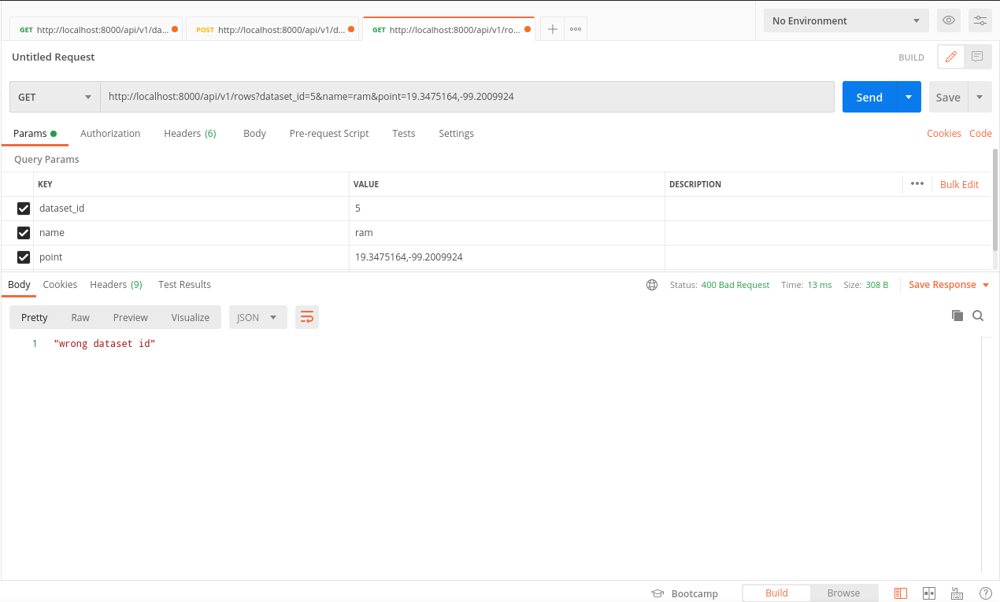

## API DATASETS DJANGO.

#### Description.

This API accepts an csv file and and store its rows in a postgresql database.

## Usage.

This API contains 2 endpoints.

- api/v1/datasets
- api/v1/rows

### api/v1/datasets

**get:**Returns rows by page (2 rows per page).
- number_page: query param between 0 and number of pages, if you don't now the number of pages, the API returns the number of pages if you provided a wrong number_page.
**post:**Store rows from a csv file.
- file: form data param, csv file, must contains just latitude, longitude, client_id and client_name.
- name: form data param, dataset's name.

### api/v1/rows
**get:**Returns rows filtered by dataset_id, name and point.

- dataset_id: query param, dataset's id.
- name: client name.
- point: Geographical point, latitude and longitude. (point=-5.3458497,39,23847).

## Install.
```sh 
$ sudo apt-get install gdal-bin
$ pip3 install requeriments.txt

$ docker pull https://hub.docker.com/r/mdillon/postgis/ #optional
sudo docker run --name post-gis -p 5432:5432 -d -e POSTGRES_PASSWORD=abraxas mdillon/postgis 


$ python3 manage.py migrate
$ python3 manage.py runserver

```

### Make sure add this to settings.py
'ENGINE': 'django.contrib.gis.db.backends.postgis', 

SERIALIZATION_MODULES = {
    "geojson": "django.contrib.gis.serializers.geojson", 
}

### Docker compose 
```sh 
$ sudo docker-compose run web django-admin startproject abraxasapi .
``` 

### Test
```sh 
$ python3 manage.py test 
#or
$ python3 manage.py test api

``` 

### USAGE EXAMPLES:
**api/v1/datasets, get**


**api/v1/rows, get**




**test**


